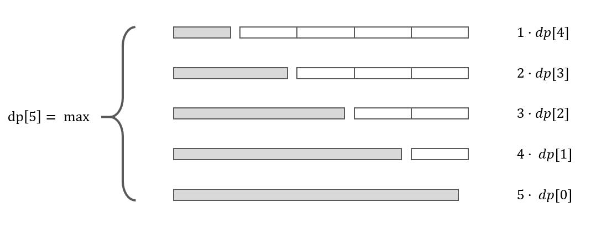

剑指Offer典型题整理 - 争取做最好的题解

# 剑指Offer14-剪绳子

整理时间：2020年02月24日


### 1 题目描述

给你一根长度为 n 的绳子，请把绳子剪成整数长度的 m 段（m、n都是整数，n>1并且m>1），每段绳子的长度记为 k[0], k[1], ..., k[m] 。请问 k[0]\*k[1]\*...\*k[m] 可能的最大乘积是多少？例如，当绳子的长度是8时，我们把它剪成长度分别为2、3、3的三段，此时得到的最大乘积是18。


**示例**

```
输入: 2
输出: 1
解释: 2 = 1 + 1, 1 × 1 = 1

输入: 10
输出: 36
解释: 10 = 3 + 3 + 4, 3 × 3 × 4 = 36
```


**限制：**

- 2 <= n <= 58


### 2 题解

#### 2.1 动态规划解法

这是妥妥的动态规划问题~，对于一条长为5的绳子，我们有如下选择：



其中左边灰色的部分表示将该段绳子看作整体不再切分，否则会有很多重复计算。因此得到递推关系式：
$$
dp[i] = max(j*dp[i-j]), j \in [1,i]
$$
递归终止条件为：
$$
dp[0] = 1
$$


`C++代码`

```cpp
#include <algorithm>
class Solution {
public:
    int cuttingRope(int n) {
        if (n <= 3) return n - 1;
        vector<int> dp(n+1);
        dp[0] = 1;
        for (int i = 1; i <= n; i++) {
            for (int j = 1; j <= i; j++) {
                dp[i] = max(dp[i], j * dp[i - j]);
            }
        }
        return dp[n];
    }
};
```

*该方法的时间复杂度为$O(n^2)$，空间复杂度为$O(n)$.


#### 2.2 神奇的数学解法

看到前面的动态规划解法，有没有觉得自己很酷，真的会动态规划求解问题了？然鹅看完下面这种解法，你会忍不住说一句：辣鸡动态规划，还比不上贪心算法，嘿嘿。

通过数学归纳法，能够得到如下结论：

- 大于3的数字都可以被拆分为多个小因子，这些小因子的和为该数字本身，且乘积大于该数字本身；
- 拆分规则：为了使得乘积最大，尽可能地拆分成3和2的和，且3越多越好。

基于上面的结论，能够得到如下贪心解法：

- 当n小于等于3时，直接返回n-1；
- 求n除以3的整数部分a和余数部分b:
  - 如果余数为0：那么直接返回$3^a$;
  - 如果余数为1：那么将最后一个3和余数1转换为两个2，返回$4*3^{a-1}$;
  - 如果余数为2：那么直接返回$2*3^a$

`C++代码`

```cpp
#include <cmath>
class Solution {
public:
    int integerBreak(int n) {
        if (n <= 3) return n - 1;
        int a = n / 3;
        int b = n % 3;
        return b == 0 ? pow(3, a) : b == 1 ? 4 * pow(3, a - 1) : 2 * pow(3, a);
    }
};
```

*上面代码时间复杂度为$O(1)$，空间复杂度为$O(1)$.


(完)

