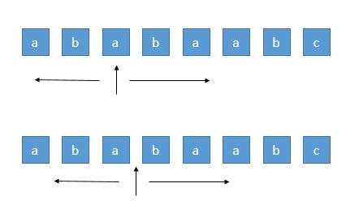

# LeetCode5-最长回文子串

整理时间：2020年03月01日

*本题难度较高，本菜鸡参考题解思路完成*


### 1 题目描述

给定一个字符串 `s`，找到 `s` 中最长的回文子串。你可以假设 `s` 的最大长度为 1000。


**示例 1：**

```
输入: "babad"
输出: "bab"
注意: "aba" 也是一个有效答案。

输入: "cbbd"
输出: "bb"
```


### 2 题解

回文串系列题目都挺恶心的，因此本文就从最暴力的解法开始一步一步进行优化。

#### 2.1 暴力解法

最暴力的解法，时间复杂度$O(n^3)$，会超时，上代码：

`C++代码`

```cpp
class Solution {
public:
    // 前闭后闭区间
    bool checkPalindromic(string& s, int start, int end) {
        if (end - start < 0) return false;
        while (start < end) {
            if (s[start] != s[end]) return false;
            start ++; end --;
        }
        return true;
    }

    string longestPalindrome(string s) {
        string ret;
        for (int i = 1; i < s.size() + 1; i++) {
            for (int j = 1; j <= i; j++) {
                if (checkPalindromic(s, j - 1, i - 1) && (i - j + 1) > ret.size()) {
                    ret = s.substr(j - 1, i - j + 1);
                }
            }
        }
        return ret;
    }
};
```


#### 2.2 求最长公共子串

思路：将原来的字符串s反向复制一份得到s'，将问题转化为求这两个字符串的最长公共子串（这就是一个DP问题了），时间复杂度$O(n^2)$。该方法理论可行，但是可能会存在一些问题，如：

```cpp
string S1 = "abacdfgdcaba"
string S2 = "abacdgfdcaba"

// 则求得最长公共子串为"abacd",显然，这不是回文。
```

因此在使用的时候需要将这种错误的情况排除。为了纠正这一点，每当我们找到最长的公共子串的候选项时，都需要检查子串的索引是否与反向子串的原始索引相同。如果相同，那么我们尝试更新目前为止找到的最长回文子串；如果不是，我们就跳过这个候选项并继续寻找下一个候选。[1]

推荐一个题解 [2]。


#### 2.3 动态规划

动态规划解法基于这样的思路：既然肯定需要知道任意两个区间内的子串是否为回文串，那不如直接定义一个二维矩阵将这个结果先记下来，后面需要的时候直接查表就好了。而且能够发现s[i, j]是否为回文串取决于s[i+1,j-1]是否为回文串，递推公式如下：

```cpp
dp[i][j] = dp[i+1][j-1] && s[i] == s[j]
```

基于此可以将求解这个矩阵的时间复杂度降为$O(n^2)$。

##### 求解矩阵

长度为1的字符串（i==j，即矩阵对角线）肯定是回文串，因此可以直接赋值为`true`；其他情况需要逐个判断。生成dp矩阵的代码如下：

```cpp
vector<vector<int>> dp(n);
for (int i = 0; i < n; i++) dp[i].resize(n);
string ret;

for (int i = n - 1; i >= 0; i--) {
    for (int j = i; j < n; j++) {
        dp[i][j] = s[i] == s[j] && (j - i < 2 || dp[i + 1][j - 1]);
        }
    }
}
```

最终的代码如下：

```cpp
class Solution {
public:
	string longestPalindrome(string s) {
        int n = s.size();
        vector<vector<int>> dp(n);
        for (int i = 0; i < n; i++) dp[i].resize(n);

        string ret;

        for (int i = n - 1; i >= 0; i--) {
            for (int j = i; j < n; j++) {
                dp[i][j] = s[i] == s[j] && (j - i < 2 || dp[i + 1][j - 1]);
                if (dp[i][j] && j - i + 1 > ret.length()) {
                    ret = s.substr(i, j - i + 1);
                }
            }
        }
        return ret;
    }
};
```

*上面的代码可以AC，时间复杂度$O(n^2)$，空间复杂度$O(n^2)$。


#### 2.4 扩展中心

我们知道回文串一定是对称的，所以我们可以每次循环选择一个中心，进行左右扩展，判断左右字符是否相等即可。



由于存在奇数的字符串和偶数的字符串，所以我们需要从一个字符开始扩展，或者从两个字符之间开始扩展，所以总共有 `n+n-1` 个中心。

`C++代码`

```cpp
class Solution {
public:
	string longestPalindrome(string s) {
        if (s.length() <= 1) return s;
        int start = 0, end = 0;
        for (int i = 0; i < s.length(); i++) {
            // 从一个字符开始扩展
            int len1 = expandAroundCenter(s, i, i);
            // 从两个字符中间扩展
        	int len2 = expandAroundCenter(s, i, i + 1);
            int len = max(len1, len2);
            if (len > end - start) {
                start = i - (len - 1) / 2;
                end = start + len;
            }
        }
    	return s.substr(start, end - start);
    }
    
    int expandAroundCenter(string s, int left, int right) {
        while (left >= 0 && right < s.length() && s[left] == s[right]) {
            left --;
            right ++;
        }
        return right - left - 1;
    }
    
};
```

*上面的代码可以AC，时间复杂度$O(n^2)$，空间复杂度$O(1)$。


#### 2.5 Manacher‘s Algorithm

马拉车算法 Manacher‘s Algorithm 是用来查找一个字符串的最长回文子串的线性方法，由一个叫 Manacher 的人在 1975 年发明的，这个方法的最大贡献是在于**将时间复杂度提升到了线性**。

本文暂时不整理该解法，后面会有一期专题。


### 3 参考资料

[1] https://leetcode-cn.com/problems/longest-palindromic-substring/solution/zui-chang-hui-wen-zi-chuan-by-leetcode/

[2] https://leetcode-cn.com/problems/longest-palindromic-substring/solution/xiang-xi-tong-su-de-si-lu-fen-xi-duo-jie-fa-bao-gu/